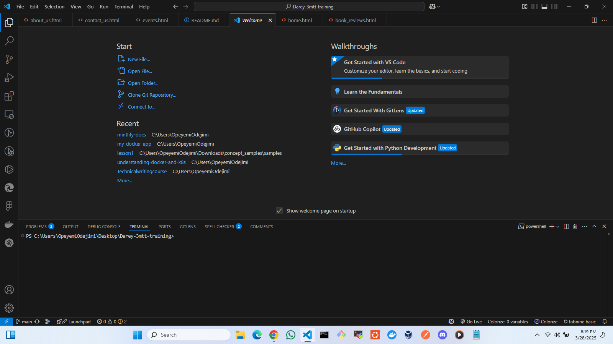
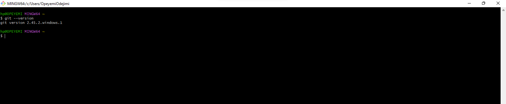
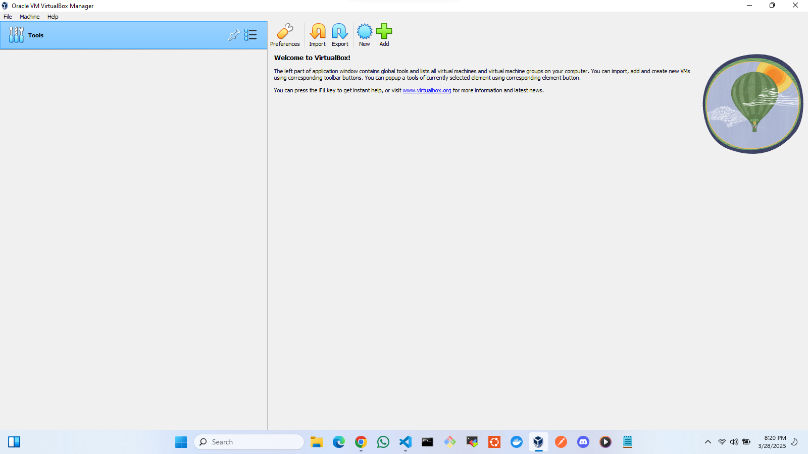
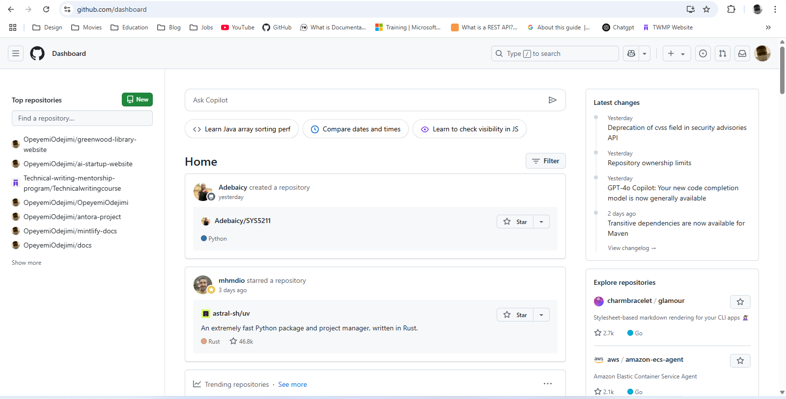
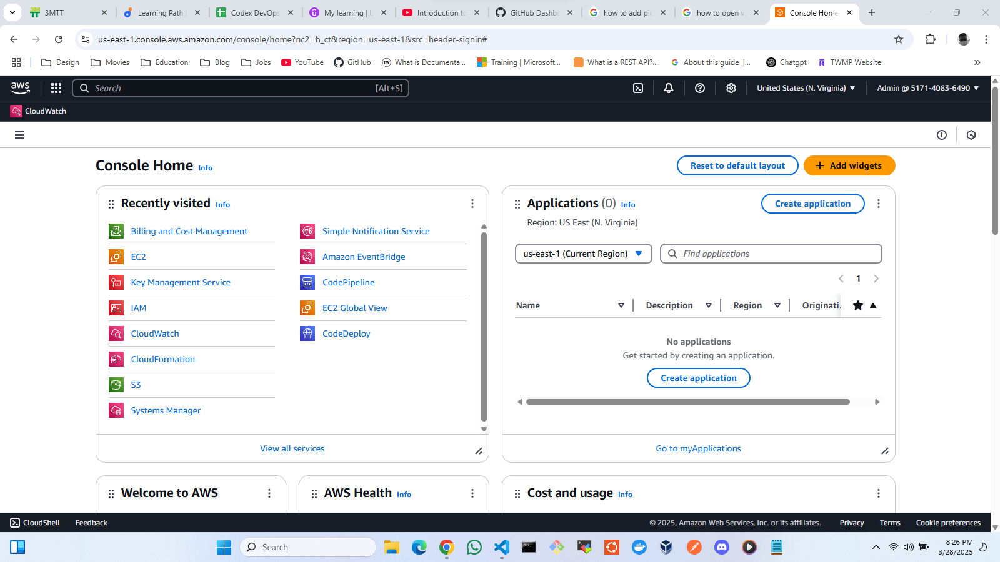

# 3MTT TECH ENVIRONMENT SETUP PROJECT

This repository contains the required components for the first project in the ongoing 3mtt DevOps training. The goal of the project is to ensure students set up their technical environment which will be used throughout their learning journey.

## The required Environments 

*  **Visual Studio Code (VS Code)**
*  **Git**
*  **Oracle VirtualBox**
*  **Ubuntu**
*  **Github Account**
*  **Amazon Web Services Account**

## Screenshots of the installed prorgrams and accounts

* **VS Code**
  

* **Git**
  

* **Oracle Virtualbox**
  

* **Github Account**
  

* **Amazone web service Account**
  

